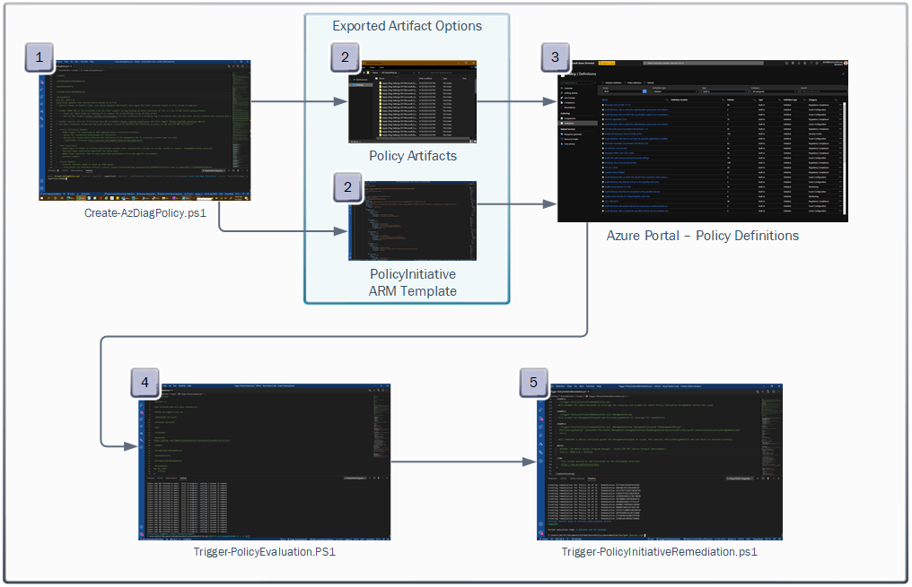
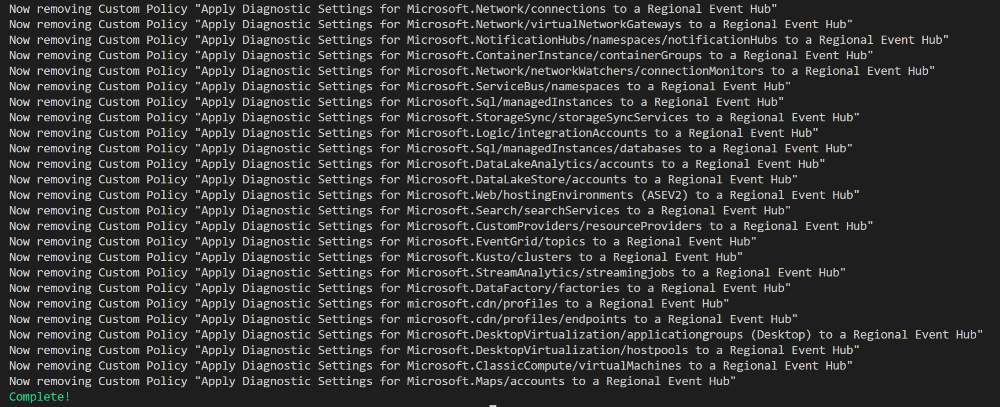

# DOCUMENTATION FOR AZURE POLICY SCRIPTS

This documentation is meant to provide a guide to the use of the scripts sourced in this repo.  These scripts are all provided as examples to be used as a starting point for assisting in the creation and management of your Azure Diagnostic Policies for your Azure Resources.

## Topics Covered

- [Overview of Create-AzDiagPolicy.PS1](./README.md#overview-of-create-azdiagpolicyps1) 
- [Overview of Trigger-PolicyEvaluation.PS1](./README.md#overview-of-trigger-policyEvaluationps1) 
- [Overview of Trigger-PolicyInitiativeRemediation.PS1](./README.md#overview-of-trigger-policyinitiativeremediationps1)

## Flow Diagram
1. **Create-AzDiagPolicy.PS1**: Used to generate the policy artifacts for Azure Diagnostics or an ARM Template (POlicy Initiative) all menu driven or providing parameter options to run silently
1. **Exported Artifacts**: Use these exported artifacts
1. **Import POlicy / Policy Initiative to Azure**: Import one by one via Azure CLI / PowerShell (policies) or deploy the ARM template export to create all policies in an initiative in seconds!
1. **Trigger-PolicyEvaluation.PS1**: Once imported and assigned to a scope in Azure, use the trigger policy evaluation script to speed up the time it takes to relfect compliance against existing resources
1. **Trigger-PolicyInitiativeRemediation**: Leverage this script to completely remediation a policy initiative at a scope of Subscription or Management Group (creating of individual remediation jobs for each policy in a targeted assigned initiative in minutes!)

   


# OVERVIEW OF CREATE-AZDIAGPOLICY.PS1

<span style="color:dodgerBlue">**UPDATE**</span> - 
June 7, 2020 v2.0
* Azure Azure Policy Initiative ARM template can now be exported by Sink Type
* "Kind" is now supported for resourceTypes in Policies Rule Evaluation
* Execution time tracking added
* Prettify function for JSON
 
## About the Script (Create-AzDiagPolicy.PS1)
**Create-AzDiagPolicy.ps1** is a script that creates *Azure Custom Policies for Azure resource types that support Azure Diagnostics logs and metrics*.  Policies can be created for both **Event Hub and Log Analytics** sink points with this script.  Currently, this script will only provide the policies for the resource types you **have within** the Azure Subscription that you provide either via the cmdline parameter **-SubscriptionId** or by selecting a subscription from the menu provided.  This script can also be leveraged to create an **Azure Policy Initiative ARM Template**.

* Optionally you can supply a **-tenant** switch to scan your entire Azure AD Tenant 

    > **Note**:
    > Please use caution when using this option as it will take quite some time to scan thousands of subscriptions!
* **-ManagementGroup** switch can optionally be leveraged with  **-ManagementGroupID** via parameter or select from a Management Group menu (if ManagementGroup parameter switch is utilized) 

## Reviewing Available Parameters
The following cmdline parameters are available with this script to help customize the experience and remove all prompting during execution.


Parameter details are contained within the synopsis of the script for more information. From the PowerShell console type the following to get a full detailed listing of parameters and their use.

```azurepowershell-interactive
  get-help .\Create-AzDiagPolicy.ps1 -Parameter * 
```
## Executing the Script (Examples)
Examples of how to use the script can be found by executing the following from the PowerShell console

```azurepowershell-interactive
  get-help .\Create-AzDiagPolicy.ps1 -examples 
```
## Exporting Event Hub and Log Analytics Custom Azure Policies
The following parameters will export Event Hub and Log Analytics Policies for Azure Diagnostics to a relative path of **.\PolicyExports** and validate all JSON export content as a last step.

```azurepowershell-interactive
  .\Create-AzDiagPolicy.ps1 -ExportEH -ExportLA -ExportDir .\PolicyExports -ValidateJSON -SubscriptionId "<SUBID>"
```


You are then prompted with a list of resourceTypes to choose from. You can select “22” below to export all policies for all resourceTypes detected or you can simply select the one you care about.  You can also provide that on cmdline via parameter **-ExportAll**.


Once you've selected your option and pressed enter, the details of the export / creation of Azure Policy files and optional validation is displayed.


The results of this export represent a series of subfolders for each ResourceType and Policy Type you have opted to create.


- azurepolicy.json : This is the full json file needed to create a policy within Azure
- azurepolicy.parameters.json : This file represents the parameters for your policy 
- azurepolicy.rules.json: This file has all the rules that your policy is leveraging to go against Azure for compliance evaluation 

    > **Note**:
    > Each of the above files are required and leveraged to create a custom Azure Policy in Azure via CLI or PowerShell (shown next)

Opening up and reviewing the **azurepolicy.json** artifact will provide you details on the structure and properties of the newly created custom Azure Policy.


### Importing the Custom Policies into Azure
 Next, the below shows you an example of how you can leverage the created policy artifacts to import directly into Azure Policy.


Example script snippit below
```azurepowershell-interactive
Select-AzSubscription -SubscriptionName <Subscription Name>

$definition = New-AzPolicyDefinition -Name "apply-diagnostic-setting-azsql-loganalytics" `
 -Metadata '{ "category":"Monitoring" }' `
 -DisplayName "[Demo]Apply Diagnostic Settings for Azure SQL to a Log Analytics Workspace" `
 -description "This policy automatically deploys diagnostic settings for Azure SQL to point to a Log Analytics Workspace." `
 -Policy '.\PolicyExports\Apply-Diag-Settings-LA-Microsoft.Sql-servers-databases\azurepolicy.rules.json' `
 -Parameter '.\PolicyExports\Apply-Diag-Settings-LA-Microsoft.Sql-servers-databases\azurepolicy.parameters.json' 

$definition
```
  > **Note**:
  > Pay close attention to the **-Metadata** parameter indicating the proper way to set a category in Azure Policy so it can be searched and sorted once imported.

### Reviewing Your Imported Policy
Once you've imported your custom policy to the Azure Policy environment, you can located it by going to **Azure Policy / Definitions** and searching on the **DisplayName** you provided in the previous example.


Finally - you can select the policy to review the actual contents (JSON) within and how it is organized.


From here you can assign this individual policy to a scope (Subscription/Management Group / Resource Group) to enforce it within your environment.

## Event Hub and Log Analytics **Policy Initiatve** ARM Templates 

This script also provides the option to export a set of custom policies wrapped in a Policy Iniative in an exported ARM template that can be imported into Azure via an ARM deployment to be able to be assigned to a scope.  The benefits of this option are:
1. A single Policy Initiative can be assigned to a scope instead of multiple policies being assigned individually per resourceType

1. A single Policy Initiative will leverage a single Managed Idenity upon Policy Initiative assignment (in contrast to a single Managed Idenity per policy if assigned per resourceType individually)

3. A Policy Initiative supported by an ARM template deployment can be deployed seamlessly with a single command and mangaement of this initiative is much more straight forward that managing 10's of policies utilizing the same parameters.

### Creating a Policy Initiative ARM Template for Log Analytics or Event Hub

  The below script and parameter combination provides the following
  * Allowing you to define the display name for the Policy Initiative 
  * Predetermine the templatefile name for the Policy Initiative export
  * Export all resourceTypes without prompting
  * Creates a Log Analytics Policy Initiative
  * Leverages all subs within a Management Group for analysis 
  * Bypasses location for rules evaluation so that a single Log Analytics workspace can be used for all regions for this initiative

  > Note the display name is validated that it is less than 127 chars long if provided.  Script will break to prompt with an error if that value is either exceeded or the value is less than 1 char.  To see ARM limits please go to https://aka.ms/AzureLimits for more information.

```azurepowershell-interactive
.\Create-AzDiagPolicy.ps1 -ExportAll -ExportLA -ValidateJSON -ExportDir ".\LogPolicies" -ManagementGroup -AllRegions -ExportInitiative -InitiativeDisplayName "Azure Diagnostics Policy Initiative for a Log Analytics Workspace" -TemplateFileName 'ARMTemplateExport'
```
### Deploying the Exported ARM Template to Azure
Once you've successfully exported your ARM Template for your custom policies supporting Azure Diagnostics (Log Analytics or Event Hub sink points), you can simply deploy the ARM template to Azure to import the related policies and policy initiative.

``` azurepowershell -interactive
Select-AzSubscription -Subscription <subscriptionID or Name>

New-AzDeployment -Name "<Deployment Name>"-TemplateFile .\exporttest\EHDemo.json -Location 'South Central US' -Verbose
```


> **Note**: On occasion, you may need to deploy the Policy Initiative ARM Template a second time due to latency in custom policy import and dependencies upon importing the policy initiative.  If a failure occurs during deployment, please try to redeploy.

> **Additional Note**: Azure Resource Manager has a limit of 4MB ARM Template JSON payload during an ARM deployment.

For very large templates, you could utilize the following to compress your JSON within your ARM template prior to deployment. This will render the JSON unreadable but remove the whitespace and reduce the overall size of the ARM template substantially.

``` azurepowershell
$JSON = $(Get-content .\EHPolicy\PolicyInitExport.json|convertfrom-json|convertto-json -depth 50 -Compress)|Out-File .\compressed.json
```

### Reviewing Imported Policy Initiative
Go to Policy 🠊 Definitions 🠊 Initiative (definition type) 🠊 Custom (type) and select the new Policy Initiative to review the properties.


### Removing a Deployed Policy Initiatve
Once you have deployed your policy initiative to Azure via the exported ARM template, you may be interested in potentially removing and redeploying (for testing / redeployment with new settings and parameters).  The following script has been provided to allow you to point at an ARM Template used to deploy a Policy Initiative, and remove the initaitive and dependenct policies from Azure.  

> <span style="color:orange">**Warning**</span> this process is destructive.  This process will also fail to remove resources that are currently assigned, or are also dependent resources in other policy initiatives within Azure.

``` azurepowershell -interactive
.\Remove-PolicyInitDeployment.ps1 -subscriptionId '2bb3c706-993b-41e8-9212-3a199105f5f5' -ARMTemplate .\exporttest\ARM-Template-azurepolicyinit.json
```


# Overview of Trigger-PolicyEvaluation.ps1

Detail

## Content

# Overview of Trigger-PolicyInitiativeRemediation.PS1

Detail

## Content For Policyremediation

## See also

- [PowerShell Gallery (https://aka.ms/CreateAzDiagPolicies)](https://aka.ms/CreateAzDiagPolicies)
- [Tutorial: Create and manage policies to enforce compliance](https://docs.microsoft.com/en-us/azure/governance/policy/tutorials/create-and-manage)
